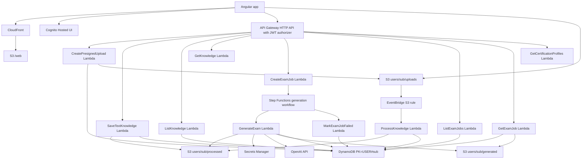

# Technical Architecture

This document explains the Phase 2 architecture for the Exam Prep app.

The root [README](../README.md) is the non-technical overview. This file is for developers and technical reviewers.

## Architecture Goals

- Keep the app serverless-first
- Add real user accounts and per-user data isolation
- Support `PDF`, `TXT`, and `DOCX` material ingestion
- Keep generation async and retryable
- Avoid always-on infrastructure and vector databases in Phase 2

## AWS Services

- `AWS SAM / CloudFormation`: infrastructure as code
- `CloudFront`: serves the Angular app
- `S3`: stores Angular assets, uploads, processed knowledge, and generated results
- `Cognito`: Hosted UI sign-in and JWT identity
- `API Gateway HTTP API`: authenticated API entry point
- `Lambda`: ingestion, processing, retrieval, and generation handlers
- `DynamoDB`: user-scoped metadata for sources and jobs
- `EventBridge`: routes uploaded S3 objects to the processor
- `Step Functions`: retries exam generation and records final failures
- `Secrets Manager`: stores the OpenAI API key
- `OpenAI API`: generates exam questions

## Runtime Diagram

## Auth And Isolation

All app API routes use the API Gateway JWT authorizer backed by Cognito.

Each Lambda reads the authenticated user from:

`requestContext.authorizer.jwt.claims.sub`

Data is scoped by user:

- DynamoDB partition key: `PK = USER#{sub}`
- Source records: `SK = DOC#{documentId}`
- Exam job records: `SK = JOB#{jobId}`
- S3 uploads: `users/{sub}/uploads/...`
- S3 processed files: `users/{sub}/processed/...`
- S3 generated exams: `users/{sub}/generated/...`

Phase 1 data under `PK=APP#SHARED` is not migrated by default.

## API Routes

Authenticated routes:

- `POST /uploads/presign`
- `POST /knowledge/text`
- `GET /knowledge`
- `GET /knowledge/{documentId}`
- `POST /exam-jobs`
- `GET /exam-jobs`
- `GET /exam-jobs/{jobId}`
- `GET /certification-profiles`

## Storage Layout

S3 prefixes:

- `web/`: Angular build output
- `users/{sub}/uploads/`: original uploaded files
- `users/{sub}/processed/`: normalized and chunked knowledge JSON
- `users/{sub}/generated/`: completed exam results

## Lambda Responsibilities

- `CreatePresignedUploadFunction`: validates `PDF`/`TXT`/`DOCX` metadata and returns a user-scoped presigned URL
- `SaveTextKnowledgeFunction`: saves pasted text as a ready user-scoped source
- `ProcessKnowledgeFunction`: extracts text from uploaded files and writes processed chunks
- `ListKnowledgeFunction`: lists the signed-in user's sources
- `GetKnowledgeFunction`: returns one signed-in user's source status
- `CreateExamJobFunction`: creates a job and starts the Step Functions workflow
- `ListExamJobsFunction`: returns saved exam history for the signed-in user
- `GetExamJobFunction`: returns job status and completed result
- `GetCertificationProfilesFunction`: returns static exam profile defaults
- `GenerateExamFunction`: builds prompts, calls OpenAI, validates JSON, and stores the result
- `MarkExamJobFailedFunction`: marks a job failed after Step Functions retries are exhausted

## Processing Flow

Text sources are processed immediately. File sources are async:

1. Browser requests a presigned upload URL.
2. Browser uploads directly to S3.
3. S3 emits an object-created event.
4. EventBridge invokes the processor Lambda.
5. Processor extracts text from `PDF`, `TXT`, or `DOCX`.
6. Processor writes chunked JSON to S3 and marks the source `READY` or `FAILED`.
7. Angular polls the source status while processing is active.

## Generation Flow

Exam generation uses Step Functions:

1. Angular submits selected ready source IDs and exam settings.
2. API creates a `QUEUED` job under the signed-in user.
3. API starts a Step Functions execution.
4. Step Functions invokes the generator Lambda with retry policy.
5. Generator loads processed chunks, builds the prompt, calls OpenAI, validates output, and stores the result.
6. If retries are exhausted, Step Functions invokes the failure Lambda to mark the job `FAILED`.
7. Angular polls the job status and can later reopen completed jobs from history.

## AI Design

The app uses RAG-lite:

- selected source chunks are inserted directly into the prompt
- no embeddings or vector database are used
- output must match a strict JSON shape
- generated exams are validated before storage
- every question must cite source chunk IDs
- missing hints are filled with a backend fallback

## Cost Guardrails

Idle cost remains low because Cognito, Step Functions, Lambda, API Gateway, DynamoDB on-demand, and S3 are usage-based for this workload.

OpenAI remains the main variable cost.

Avoided services:

- NAT Gateway
- RDS
- ElastiCache
- ECS
- Kubernetes
- vector database
